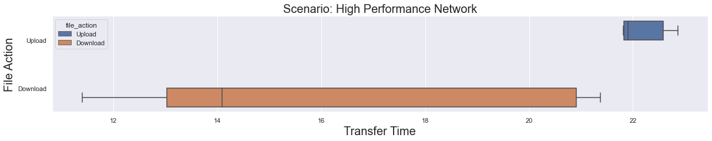
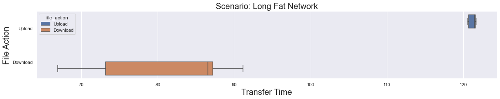
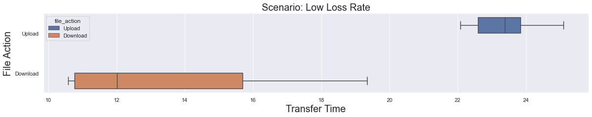
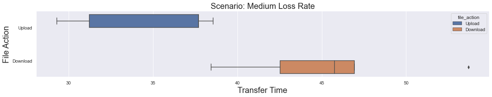
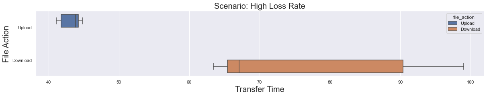
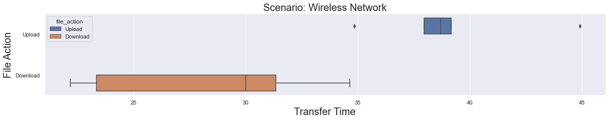

# Anonymous share via socket programming

This is a client-server implementation using FTP protocol written in python which focuses on transfering the files.

# Running:

To start the server/client program:

Run python server.py file so that it could accept connections from multiple clients. Then we run clients in different windows machines and get it connected to the server. 

## Running Server
1. Clone the repository in windows machine
2. Run pip install 
3. Navigate to `source_code -> server`
4. Run `>python Server.py`

## Running Client
1. Clone the repository in windows machine
2. Run pip install
3. Navigate to `source_code -> client`
4. Run `>python Client.py`

### - Connect to Server: 
#### &ensp;  creates connection to the server
    Here, client enters IP address and Port number manually to make a connect request.

### - Upload files:
#### &ensp;  Uploads the files from client to the server storage location.
    Here, client enters absolute paths of files in comma separated and server responds with the storage location path.

### - Download files
#### &ensp; Downloads the selected files from the server storage location to the client storage.
    Here, client enters the storage path and server responds with the list of files available in the storage path. 

    Then, client selects the files that he wants to download.

### - List files
#### &ensp; Displays the list of files available in the storage location.
    Here, Client requests the server for the list of files with the storage path.

### - Quit
#### &ensp; Closes the connection
    This command terminates the connection.

### - Manual
#### &ensp; Manual execution of commands.

        Commands:

        connect <IP_address> <port_number>

        OPTS UTF8 ON 

        USER anonymous 

        PASS password 

        MKD <storage_path> 

        SETEXPIRY <storage_path> <expiry_date> 

        CWD <storage_path> 

        PORT <h1>, <h2>, <h3>, <h4>, <p1>, <p2> 

        STOR <file_name> 

        RETR <file_name> 

        LIST <storage_path> 

        QUIT  

        Response Messages : 

        000 Expiration date set. 

        001 Expiration date set failed. 

        150 Ok to send data. 

        150 Here comes the directory listing. 

        150 Opening BINARY mode data connection for <file_name> 

        200 PORT command successful. Consider using PASV. 

        200 Always in UTF8 mode. 

        220 Service ready for new user; Welcome to FTP server. 

        221 Goodbye. 

        226 Transfer complete. 

        226 Directory send OK. 

        230 Login successful. 

        250 Directory successfully changed. 

        257 <storage_path> created. 

        331 Please specify the password. 

        425 Can't open data connection. 

        426 Transfer aborted. 

        451 Requested action aborted: local error in processing. 

        500 Connection Close Error. 

        502 Command not implemented. 

        530 Login failed. 

        550 Failed to change directory. 

        550 Create directory operation failed. 

        550 Requested action not taken. File unavailable (e.g., file not found, no access).
# Installation - 1 Deliverables:
Making and Closing the connection in between client and server.

# Installation - 2 Deliverables:
Upload, download files in between the client and server. List files in the given storage location. 

# Installation - 3 Deliverables:
Creating a GUI application and integrating it with the above mentioned functionality.

# GUI Implementation:

## Running Client
1. Clone the repository in windows machine
2. Run pip install
3. Navigate to `source_code -> client`
4. Run `>python ClientGUI.py`

### option: connect to server: 
    By selecting this option, client enters the IP address and Port number of the server. Once the client connects to server, this option will be updated to 'disconnect'
    

The homepage has three widgets:
1. Upload files
    - when client selects the upload files option, the client is allowed to select a maximum of 6 files along with the expiration date and server responds with the storage location path. The client is also allowed to copy the location path by selecting - copy to clipboard which can be used later for downloading files.
2. View files
    - client enters the copied storage path and server responds with the list of files available in the storage path.
3. Download files
    - client selects the files that he wants to download either single file or multiple files from his system. The files will be available for download only within the expiration date specified.

### option : Disconnect
    By selecting this client connection gets terminated.

# Correctness Scenarios:
---
Scenario |	How you will implement scenario |	How you will prove correctness
--------------- | --------------|-------------
Server running at some ip_address, port:21 and accepting incoming connections.	| We will run the server in the Azure Linux VM and try to connect to the server using telnet. |	If the server responds with the message ‘220 Welcome to the FTP server’.
Disabling the upload, view, download options in the GUI Homepage, if client is not connected to the server. | We will run the application GUI and check the cursor pointer behavior and click events on the homepage. | If the cursor pointer is not turned into clickable pointer and the click events are disabled.
Handling invalid address input format in the application GUI.	| We will provide invalid format of the server IP address and port in the dialog provided in the application GUI. |	If the GUI displays invalid address message and asks the user to enter the valid credentials.
Connection establishment from the GUI application.	| We will try to establish the connection from the GUI application running in windows machine.	| If the connect to server button is turned into disconnect in the GUI. This shows the connection is successfully established.
Handling duplicates file selection while uploading the file in the application GUI.	| We will try to select the same files from the file explorer while uploading. |	If the application displays the already selected file only once. |
Expiration date entry validation in the upload files tab. |	We will select upload button without entering the expiry date in the upload files tab. |	If the application shows the error message at expiry date field when the upload button is selected. 
Displaying the storage path and the expiry date after a successful upload.	| We will upload the files to the server.	| In GUI: If the application displays the storage path along with the expiry date in the application GUI after successful file upload. In Wireshark: If the response code is ‘226 Transfer Complete’.
Viewing the files in the storage path. |	We will provide the valid storage path in the view files tab.	| In GUI: If the application fetches the files in the given storage path and display it in the GUI. In Wireshark: If the response code is ‘226 Directory Send OK’.
Downloading files from the storage path	| We will provide the valid storage path in the download files tab and select the download all files button.	| In GUI: If the application downloads all the files in the given storage path to the user local storage.In Wireshark: If the response code is ‘226 Transfer Complete’.
Handling the user requests if the storage path is expired |	We will provide the expired storage path in the download files or view files tab.|In GUI: If the application displays the message – ‘Storage path expired’.In Wireshark: If the response code is ‘550 Failed to change directory.; Storage path: <path> expired’.
Handling the user requests if the storage path is invalid |	We will provide the invalid storage path in the download files or view files tab. |In GUI: If the application displays the message – ‘Storage path doesn’t exist’. In Wireshark: If the response code is ‘550 Failed to change directory.; Storage path: <path> doesn't exists’
Disconnecting the user from the server.	| We will select the disconnect button in the application GUI.| In GUI: If the application redirects to homepage with the by changing disconnect button to ‘connect to server’.In Wireshark: If the response code is ‘221 Goodbye’.
Displaying the error message if the file transfer is terminated by the server.	| We will terminate the server during the file upload/download. |	If the application displays the message – ‘download/upload error.

# Performance Evaluation
---
We have considered the following scenarios in order to evaluate the application performance.  

1. High performance network
2. Long fat network
3. Low loss rate
4. Medium loss rate
5. High loss rate
6. Wireless network

The below box plot gives an overview of all the scenarios considered in our project for evaluating application performance.

The following scenarios mentioned below are plotted by considering Transfer Time as X-axis and File Action (Upload and Download) as Y-axis. Moreover, we considered the bandwidth as 100mbps for all scenarios except for Wireless network which is 10mbps.

-  # High performance network:

    Command:

        sudo tc qdisc add dev eth0 root netem rate 100mbps delay 20ms loss 0%

    Box plot:

    

    Explanation:

        In this scenario, we have observed that the average time taken for uploading a file to server is 22.20 s whereas the average time taken for downloading a file from server is 16.15 s. This clearly describes that the time taken for uploading a file is more compared to downloading the file. This is because we are adding a latency of 20 ms. Hence, there is a packet delay introduced on the server side which in turn increased the time for uploading a file to server.

- # Long fat network:

    Command:

        sudo tc qdisc replace dev eth0 root netem rate 100mbps delay 500ms loss 0%

    Box-plot:

    

    Explanation:

        In this scenario, we have observed that the average time taken for uploading a file to server is 121.19 s whereas the average time taken for downloading a file from server is 81.01 s. This clearly describes that the time taken for uploading a file is more compared to downloading the file. This is because we considered a latency of 500 ms. In this case, the packet delay is more when compared to high performance network between client to server which in turn increased the time for uploading a file to server.

- # Low loss rate:

    Command:

        sudo tc qdisc replace dev eth0 root netem rate 100mbps delay 20ms loss 1%
    
    Box-plot:

    

    Explanation:

        In this scenario, we observed that the average time taken for uploading a file to server is 23.40 s whereas the average time taken for downloading a file from server is 13.68 s. This clearly describes that the time taken for uploading a file is more compared to downloading the file. This is because in this scenario we considered a packet loss rate of 1%. Hence, there are packet re-transmissions involved from client to server which in turn increased the time for uploading a file to server.

- # Medium loss rate:

    Command:

        sudo tc qdisc replace dev eth0 root netem rate 100mbps delay 20ms loss 10%
    
    Box-plot:

    

    Explanation:

        In this scenario, we observed that the average time taken for uploading a file to server is 34.89 s whereas the average time taken for downloading a file from server is 45.47 s. This clearly describes that the time taken for downloading a file is more compared to uploading the file. This is because in this scenario we considered a packet loss rate of 10%. Hence there are more number of packet re-transmissions involved when compared to Low loss rate between server to client which in turn increased the time for downloading a file from server.

- # High loss rate:

    Command:

        sudo tc qdisc replace dev eth0 root netem rate 100mbps delay 20ms loss 15%
    
    Box-plot:

    

    Explanation:

        In this scenario, we observed that the average time taken for uploading a file to server is 43.16 s whereas the average time taken for downloading a file from server is 77.06 s. This clearly describes that the time taken for downloading a file is more compared to uploading the file. This is because we considered a packet loss of 15%. Hence, the re-transmissions of the packets are more from server to client which in turn increased the time for downloading a file from server.

- # Wireless network:

    Command:

        sudo tc qdisc replace dev eth0 root netem rate 10mbps delay 60ms loss 2%
    
    Box-plot:

    

    Explanation:

        In this scenario, we observed that the average time taken for uploading a file to server is 39.12 s whereas the average time taken for downloading a file from server is 28.30 s. This clearly describes that the time taken for uploading a file is more compared to downloading the file. This is because we considered a latency of 60 ms and a packet loss rate of 2%. In this case, the delay of packets are more and packet re-transmissions are also involved from client to server which in turn increased the time for uploading a file to server.

    ## Best case scenario: 
            High Performance Network
    ## Worst case scenario:
            Long Fat Network

    - Note: 

            Other factor which influenced the application performance is the usage of Azure VM which controls the incoming and outgoing traffic for security reasons.